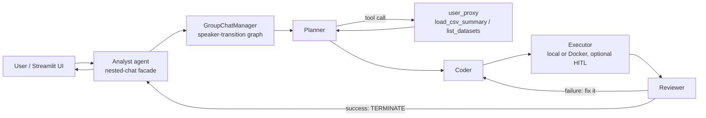

# 📊 InsightBot — Multi-Agent Data Analyst

Ask questions about any CSV in plain English. Behind a single "Analyst" agent, a hidden team of **Microsoft AutoGen** agents plans the analysis, writes Python, executes it, reviews the result — and retries automatically when the code fails.

> **Planner → Tools → Coder → Executor → Reviewer**, wrapped in a nested chat, with a Streamlit terminal-style dashboard on top.

<!-- Replace with your actual screenshot -->


---

## ✨ Features

- **Natural-language data analysis** — "Which region has the highest revenue? Plot it."
- **Self-correcting agent team** — failed code is diagnosed by a Reviewer agent and fixed by the Coder in a retry loop
- **Registered tools** (`load_csv_summary`, `list_datasets`) — the Planner inspects data on demand instead of receiving it blindly
- **Constrained speaker-transition graph** — a state machine guarantees code is always executed and always reviewed (no hallucinated results)
- **Nested-chat facade** — users talk to one Analyst agent; the 5-agent team is an implementation detail
- **Human-in-the-loop mode** (`HITL=true`) — approve every AI-generated code block before it runs
- **Docker execution mode** (`USE_DOCKER=true`) — run generated code in an isolated container
- **Streamlit dashboard** — dark financial-terminal UI with KPI cards, chart grid, data preview and run history
- **Provider-agnostic LLM config** — Groq (free), Gemini, Azure OpenAI, or any OpenAI-compatible API via `.env` only

## 🏗 Architecture



The manager's LLM only chooses **within legal graph edges** — after the Coder speaks, the *only* possible next speaker is the Executor, which structurally prevents skipped execution and hallucinated reviews.

## 🚀 Quickstart (from scratch)

**Prerequisites:** [Git](https://git-scm.com/), [uv](https://docs.astral.sh/uv/) (no Python install needed — uv downloads it), and a free LLM API key ([console.groq.com](https://console.groq.com)).

```bash
# 1. Clone
git clone https://github.com/<your-username>/insightbot.git
cd insightbot

# 2. Install everything (creates .venv, downloads Python 3.11, installs deps)
uv sync

# 3. Configure
cp .env.example .env
# open .env and paste your Groq API key

# 4. Run from the command line
uv run python -m insightbot.main "Which region has the highest revenue? Plot revenue by region." sales.csv

# 5. Or launch the dashboard
uv run streamlit run app.py     # opens http://localhost:8501
```

A sample dataset (`data/uploads/sales.csv`) is included so it works out of the box. Generated charts land in `data/outputs/`.

## ⚙️ Configuration (`.env`)

| Variable | Default | Purpose |
|---|---|---|
| `LLM_API_KEY` | — | API key (Groq / Gemini / Azure / any OpenAI-compatible) |
| `LLM_BASE_URL` | `https://api.groq.com/openai/v1` | Provider endpoint |
| `LLM_MODEL` | `llama-3.3-70b-versatile` | Model name |
| `USE_DOCKER` | `false` | Execute generated code in a Docker container |
| `HITL` | `true` | Pause for human approval before each code execution (CLI only — set `false` for the Streamlit UI) |

**Switching providers** never touches code — for example, Gemini:

```
LLM_API_KEY=<key from aistudio.google.com/apikey>
LLM_BASE_URL=https://generativelanguage.googleapis.com/v1beta/openai/
LLM_MODEL=gemini-2.0-flash
```

## 📁 Project structure

```
insightbot/
├── app.py                          # Streamlit dashboard
├── pyproject.toml                  # uv-managed dependencies
├── .env.example                    # config template
├── data/
│   ├── uploads/                    # input CSVs (sample included)
│   └── outputs/                    # generated charts
└── src/insightbot/
    ├── main.py                     # CLI entry point
    ├── config/                     # LLM config + paths/flags
    ├── tools/data_tools.py         # registered agent tools
    ├── agents/
    │   ├── team.py                 # planner, coder, executor, reviewer
    │   └── analyst.py              # nested-chat front agent
    └── workflows/analysis_flow.py  # group chat + transition graph + tool registration
```

## 🐛 Failure modes I debugged (the interesting part)

Building this surfaced four classic multi-agent failures — each fixed with a different technique:

| # | Symptom | Root cause | Fix |
|---|---|---|---|
| 1 | Reviewer said `TERMINATE`, chat kept looping | Termination check lived on an agent that never receives messages in a group chat | Moved `is_termination_msg` to the **GroupChatManager** |
| 2 | After a code failure, the Reviewer *wrote the fix itself* and terminated — the fix never ran | No negative constraints in the prompt | Explicit role contract: "NEVER write code; only TERMINATE after successful execution" |
| 3 | Manager skipped the Executor entirely; Reviewer **hallucinated** "exit code 0, chart saved" for code that never ran | `auto` speaker selection is an LLM guess | **Speaker-transition graph** — a state machine where the LLM only decides at real branch points |
| 4 | Agents claimed charts were saved when they weren't | Trusting agent narratives | Verify against ground truth (`ls data/outputs/`), and make the coder print `CHART SAVED: <path>` |

**Takeaway:** prompts set intent, structure enforces it, and ground truth verifies it.

## 🛠 Tech stack

Microsoft AutoGen (pyautogen 0.2) · Python 3.11 · uv · Streamlit · pandas · matplotlib · Docker (optional) · Groq Llama 3.3 70B (default LLM)

## 🗺 Roadmap

- [x] Two-agent chat → group chat with speaker-transition graph
- [x] Registered tools (`register_function`)
- [x] Nested-chat Analyst facade + human-in-the-loop execution gate
- [x] Streamlit terminal dashboard
- [ ] Coder-side chart composition (subplots → single PNG)
- [ ] Pydantic-validated tool inputs
- [ ] Azure Blob Storage for datasets & outputs
- [ ] Deploy on Azure Container Apps (Docker execution by default)

## 👤 Author

**Aakash Patil** — built while learning Agentic AI with Microsoft AutoGen.

## 📄 License

MIT
