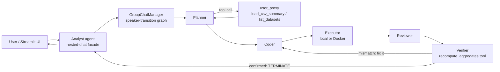

# 📊 InsightBot — Multi-Agent Data Analyst

Ask questions about any CSV in plain English. Behind a single "Analyst" agent, a hidden team of **Microsoft AutoGen** agents plans the analysis, writes Python, executes it, reviews the result, **independently re-verifies the numbers against the raw data**, and retries automatically when anything fails.

> **Planner → Tools → Coder → Executor → Reviewer → Verifier**, wrapped in a nested chat, with a Streamlit terminal-style dashboard on top.

<!-- Replace with your actual screenshot -->


---

## ✨ Features

- **Natural-language data analysis** — "Which region has the highest revenue? Plot it."
- **Self-correcting agent team** — failed code is diagnosed by a Reviewer and fixed by the Coder in a retry loop
- **Independent Verifier agent** — never trusts the Reviewer's claims; recomputes key aggregates directly from the raw CSV before allowing the conversation to end
- **Automated eval harness** — a scorecard of known-answer test cases (`uv run python -m tests.run_eval`) catches regressions after any prompt or code change
- **Registered tools** (`load_csv_summary`, `list_datasets`, `recompute_aggregates`) — agents inspect and verify data on demand instead of receiving it blindly
- **Constrained speaker-transition graph** — a state machine guarantees code is always executed, always reviewed, and always verified
- **Nested-chat facade** — users talk to one Analyst agent; the full agent team is an implementation detail
- **Dual-provider LLM config, auto-detected** — drop in either a Groq or an Azure OpenAI credential block in `.env`; the app detects which one is present
- **Optional Docker execution and human-approval modes** — generated code can run in an isolated container, and each execution can require explicit approval before running (see `src/insightbot/config/settings.py`)
- **Streamlit dashboard** — dark financial-terminal UI with dataset KPI cards, side-by-side answer + chart grid, data preview, and run history grouped into per-dataset tabs

## 🏗 Architecture



The manager's LLM only chooses **within legal graph edges** — after the Coder speaks, the *only* possible next speaker is the Executor, and only the **Verifier** may end the conversation.

## 🚀 Quickstart (from scratch)

**Prerequisites:** [Git](https://git-scm.com/), [uv](https://docs.astral.sh/uv/) (no separate Python install needed — uv can provision one), and either a free [Groq API key](https://console.groq.com) or an Azure OpenAI resource.

```bash
# 1. Clone
git clone https://github.com/<your-username>/insightbot.git
cd insightbot

# 2. Pin Python and install everything
uv python pin 3.11        # or 3.12 if that's what's available on your machine
uv sync

# 3. Configure - copy the template and fill in ONE provider block (see below)
cp .env.example .env

# 4. Verify the config resolved correctly (no tokens spent)
uv run python -c "from insightbot.config.llm_config import PROVIDER, llm_config; print(PROVIDER, '->', llm_config['config_list'][0]['model'])"

# 5. Run from the command line
uv run python -m insightbot.main "Which region has the highest revenue? Plot revenue by region." sales.csv

# 6. Or launch the dashboard
uv run streamlit run app.py     # opens http://localhost:8501

# 7. Run the automated eval suite
uv run python -m tests.run_eval
```

A sample dataset (`data/uploads/sales.csv`) is included so it works out of the box. Generated charts land in `data/outputs/`.

## ⚙️ Configuration (`.env`)

The provider is **auto-detected** from which credential block is present — keep only one.

**Groq (free):**

```
GROQ_API_KEY=gsk_your-key-here
GROQ_BASE_URL=https://api.groq.com/openai/v1
GROQ_MODEL=llama-3.3-70b-versatile
```

**Azure OpenAI:**

```
AZURE_OPENAI_MODEL=your-deployment-name
AZURE_OPENAI_API_KEY=your-key-here
AZURE_OPENAI_ENDPOINT=https://your-resource.openai.azure.com/
```

> Azure is routed through the `/openai/v1` OpenAI-compatible endpoint rather than the classic `azure` client path, because pyautogen 0.2's Azure client silently strips dots from deployment names (`gpt-5.4` → `gpt-54`), which breaks any deployment that legitimately contains a dot. Routing through the compatible endpoint sends the deployment name through untouched.

## 📁 Project structure

```
insightbot/
├── app.py                          # Streamlit dashboard
├── pyproject.toml                  # uv-managed dependencies
├── .env.example                    # config template (both provider blocks)
├── data/
│   ├── uploads/                    # input CSVs (sample included)
│   └── outputs/                    # generated charts
├── tests/
│   ├── eval_cases.py                # known-answer test cases
│   └── run_eval.py                  # automated eval runner -> pass/fail scorecard
└── src/insightbot/
    ├── main.py                     # CLI entry point
    ├── config/                     # LLM config (auto-detected provider) + paths/flags
    ├── tools/data_tools.py         # registered agent tools, incl. independent recompute
    ├── agents/
    │   ├── team.py                 # planner, coder, executor, reviewer, verifier
    │   └── analyst.py              # nested-chat front agent
    └── workflows/analysis_flow.py  # group chat + transition graph + tool registration
```

## 🧠 Key design decisions

- **Termination lives on the GroupChatManager**, not individual agents — in a group chat, only the manager receives every message, so that's the only place a termination check reliably fires.
- **The Reviewer is explicitly forbidden from writing code** and may not end the conversation — preventing unreviewed fixes from being silently applied.
- **Speaker transitions are a constrained graph, not free `auto` selection** — guarantees code is always executed and reviewed before any claim of success, rather than trusting the manager's LLM to choose the right next speaker every time.
- **A Verifier agent independently recomputes key numbers from the raw CSV** before anything can terminate, catching cases where the Reviewer's summary doesn't match the underlying data.
- **Azure is routed via `/openai/v1`** instead of the framework's native `azure` client, avoiding a bug that mangles deployment names containing dots.

## 🛠 Tech stack

Microsoft AutoGen (pyautogen 0.2) · Python 3.11+ · uv · Streamlit · pandas · matplotlib · Docker (optional) · Groq Llama 3.3 70B / Azure OpenAI GPT-5.4 (either, auto-detected)

## 🗺 Possible next steps

- Coder-side chart composition (multiple subplots into a single PNG instead of separate images)
- Pydantic-validated tool inputs
- Auto-EDA dashboard tab (schema-agnostic instant visual profile, no question required)

## 👤 Author

**Aakash Patil** — built while learning Agentic AI with Microsoft AutoGen.

## 📄 License

MIT